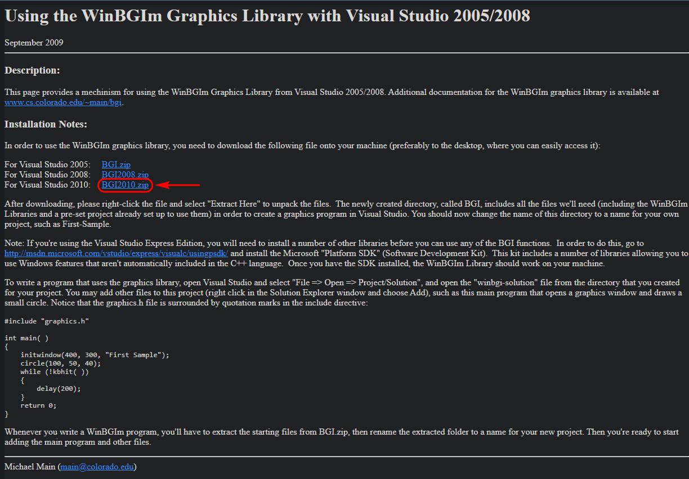
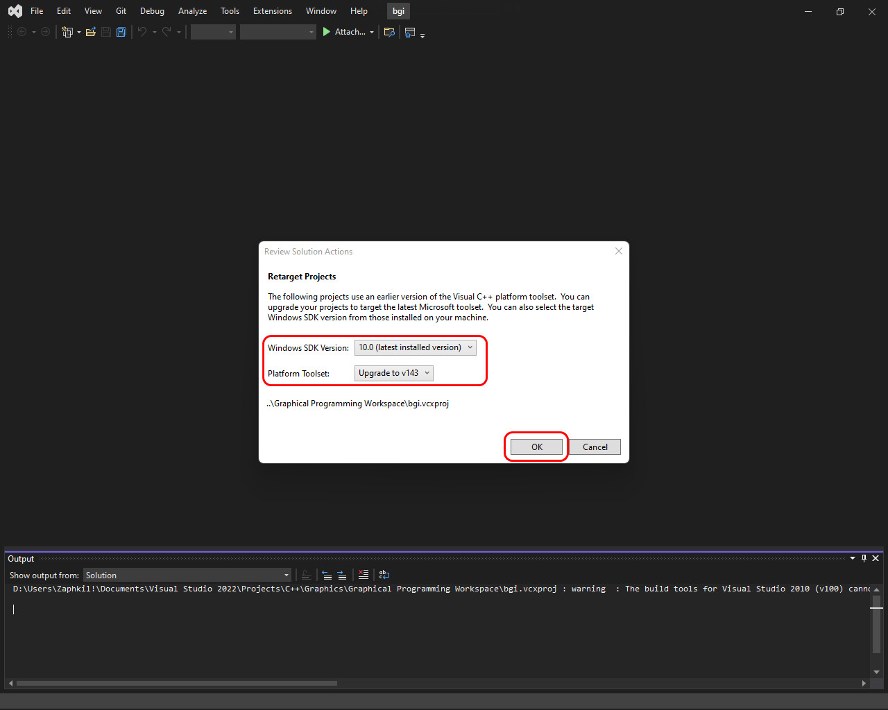

<h1 align="center"> HOW TO SETUP VISUAL STUDIO COMMUNITY FOR GRAPHICAL PROGRAMMING IN C++ using Graphic.h</h1>

## **INTRODUCTION**
Hello Everyone, Today we are going to set up Visual Studio Community Edition for Computer Graphical Programming using graphic.h in C++. 

## **WHAT IS "graphic.h"** 
The graphics.h is a header file in C/C++ that provides access to a simple graphics library that makes it possible to draw lines, rectangles, ovals, arcs, polygons, images, and strings on a graphical window.

## **WHY YOU SHOULD USE "graphic.h"** 
In India, In The field of computer science, most of the degrees has at least Computer Graphical Programming course, be it B.Tech, BCA, BSc Cs, or any other degree in Computer science department.

So, if you are taking one of the courses listed above, it is mandatory to use graphic.h for Computer Graphical Programming. 

## **WHY YOU SHOULDN'T USE  "graphic.h"** 
graphics.h is for dos based graphics with max support of 640x480 resolution based on graphics driver and mode selection.

Because, “graphics.h” is really old library and not used anymore. 

graphics.h is a 35 years old header that used to exist in Borland version of Turbo C. It is simply outdated & unsupported. 

I would also suggest not to use Bloodshed Dev-C++ as it is also a quite outdated.


**NOTE:** If you are not taking any course that "Strictly" requires you to use graphic.h for Computer Graphical Programming, and just want to learn graphic programming in general or as a hobby we highly recommend that you use one of the many libraries out there which are better (but complicated) than graphics.h. Some of them are:


1. **OpenGL using GLFW (modern openGL)(Recommended)**

OpenGL (Open Graphics Library) is a cross-language, cross-platform application programming interface (API) that use graphic hardware(GPU or Video card) for rendering 2D and 3D vector graphics.

2. **DirectX(Recommended)**

DirectX is an application program interface (API) that use graphic hardware(GPU or Video card) for creating and managing graphic and multimedia effects in applications such as games or Dynamic Web pages that will run in MS's Windows operating systems.

Latest DirectX 12 is included in Windows 10, 11

3. **SFML**

Simple and Fast Multimedia Library (SFML) is a cross-platform software development library that use graphic hardware(GPU or Video card) it is designed to provide a simple application programming interface (API) to various multimedia components in Modern computers.

4. **SDL**

SDL (Specification and Description Language) is a program design and implementation language that that use graphic hardware(GPU or Video card) for rendering 2D and 3D graphics. that is used to build actual-time event-driven systems that involve parallel processing 

Note: you can setup graphic.h to work with both [Visual studio Community](https://visualstudio.microsoft.com/vs/community/)/[Professional](https://visualstudio.microsoft.com/vs/professional/) and [Visual Studio Code](https://code.visualstudio.com/)

## **STEP-BY-STEP INSTRUCTIONS**
**Step 1:** First of all, for using "graphics.h" in the visual studio community, you should have Visual Studio Community installed in your computer. You can download its official version from Microsoft's Visual studio website [CLICK HERE](https://visualstudio.microsoft.com/vs/community/)

**Step 2:** Install Visual Studio Community as you would install any other setup. After installing Visual Studio Community, open Visual studio community installer by searching it in the start menu as shown in below screenshots


**Step 3:** Once Visual Studio Community Installer opens up click on modify to modify your installation.


**Step 4:** Choose The Highlighted workload below to download and install it in your Visual Studio Community Installation.


**Step 5:** After installing the workload, We would also need to download one more file that is **WinBGIm Graphics Library for Visual Studio**. Here **BGI** Stands for (**Borland Graphics Interface**) [Click Here](https://home.cs.colorado.edu/~main/bgi/visual/), download the “BGI2010.zip” File



**Step 6:** After downloading, right-click the file and select "Extract All" to unarchive the files in your desired path/directory.  


The new directory will be created, named BGI, it has all necessary files that you will need (including the WinBGIm which contains graphic.h, winbgim.h and winbgi.h Libraries and a pre-set project that is already set up to you to test them) in order to create a computer graphics programs in Visual Studio community. 


You should now rename of this folder to a name for your own liking that is easy to remember for you, such as “**Graphical Programming Workspace**”. And copy it to a easily accessible location such as your Document folder or your desktop. 


Navigate to that directory. And you will see a bunch of files there which also include Graphics Library files and a sample project.


**Step 7:** In this folder, open the file named “bgi.vcxproj”. and the project will open in Visual Studio Community.


**Step 8:** As the Project opens you will see a prompt that asks you to retarget the Project to target the Latest Version of Visual Studio Community. 


In this pop-up window choose the latest Windows SDK and Microsoft Platform Toolset version and click on the Ok Button as shown in below Screenshot.

And Visual Studio Community will Reconfigure the Project to target the Current Version of Visual studio community, Windows SDK and Platform Toolset version.




**Step 9:** In Visual Studio Community, Open** the solution explorer then open the source file and you will see a bunch of files there here create a new source code file(.**cpp**)


**Step 10:** Select C++ File (.**cpp**) File. Give the new file a name(we will use “Test”), and it will be added to your project.


**Step 11:** Now write this code in **test.cpp** and Save the file.


```cpp
#include "graphics.h"
#include <iostream>
#include <math.h>
#include <stdlib.h>                     // Provides exit
#include <ctype.h>  

int main()
{

    int gd = DETECT, gm;
    char data[] = "C:\\MinGW\\lib\\libbgi.a";

    initgraph(&gd, &gm, data);
    circle(200, 200, 100);
    getch();
    closegraph();

    return 0;

}
```

**Step 12:** Now build and run the Code by Clicking on **Debug** the click on **Start without Debugger** in drop down menu.


And you will see that your Program runs and a Circle is drawn on the console that opens up as shown in the screenshot.


Now, whenever you would need to write a new code just create a new file and write code in it and run just as we did for **test.cpp**

## **CONCLUSION**
In this article we have learned How we can use graphic.h in Visual Studio Community which is a part of the **Borland Graphics Interface**.

This article is especially useful for College students who are taking a Computer Graphics Course.

I hope this article helped you, if you liked it please star this repo and share it with your friends.


